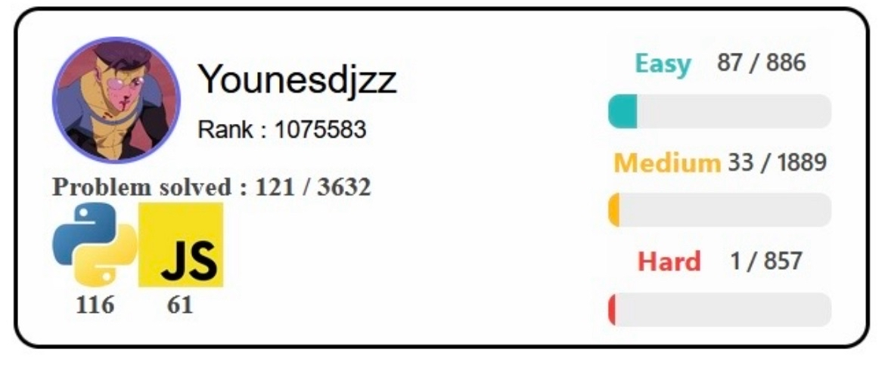
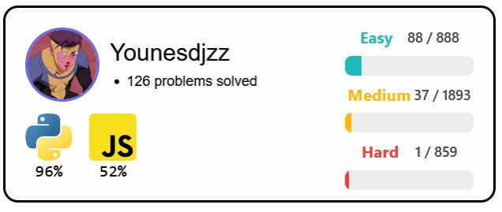
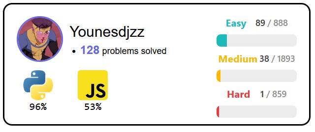
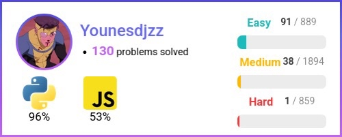

[🇬🇧 English version](README.md)

# Mon Premier Mini Projet : **Un Badge LeetCode personnalisé**

## 🎯 Objectif
L'objectif est d'afficher mon badge sur le **README de mon profil GitHub**

## 🔍 Aperçu
Ce mini-projet est développé avec **Flash**, un framework de **Python**, pour récupérer des données de **LeetCode** en utilisant une **API** **toutes les 24h**

- Hébergé sur [https://leetcode-badge.onrender.com/](https://leetcode-badge.onrender.com) (HTML/CSS)
- Hébergé dans ce **repository** : app/static/badge.png (image PNG)

⚠️ Le site web est hébergé sur **Render** donc il est possible qu'il soit en veille. Veuillez réessayer quelques minutes plus tard
  
[](https://leetcode.com/u/Yoouss/)

## 💡 La motivation derrière ce projet
Je voulais **montrer mes statistiques de LeetCode sur mon profil GitHub**, mais j'ai seulement trouvé quelques modèles en ligne et les **designs n'étaient pas à mon goût**... <br>
Alors j'ai décidé de **créer mon propre design de badge LeetCode personnalisé** après avoir posé quelques questions à **ChatGPT** pour réfléchir à la manière dont j'allais le réaliser

Cet objectif m'a poussé à **développer mes compétences en HMTL/CSS** tout en me donnant l'opportunité de **créer mon premier projet solo**

## 🛠️ Comment l'ai je développé ?
- J'ai développé mon badge **à partir de zéro**, en utilisant l'**IA** comme outil pour supporter mon **apprentissage** et renforcer mes **compétences en développement logiciel** sans en perdre le contrôle
- Tout d'abord, je l'ai designé en utilisant **HTML/CSS**, ensuite j'ai écris **un script Python de capture d'écran** en étant **assisté par l'IA**

## ❔ Comment utiliser Flask ?
- Tout d'abord, **clonez** le **repository** :
```bash
git clone https://github.com/Yoouss/leetcode-badge.git
cd leetcode-badge
```
- Ensuite, **installez** le **requirements.txt** dans un **environnement virtuel** :
```bash
python -m venv venv
source venv/bin/activate
pip install -r requirements.txt
```
- Enfin, pour **démarrer Flask**, utilisez : <br>
```bash
flask --app app --debug run
```

## 🎨 Bonus : l'évolution du design de mon badge
    
    
