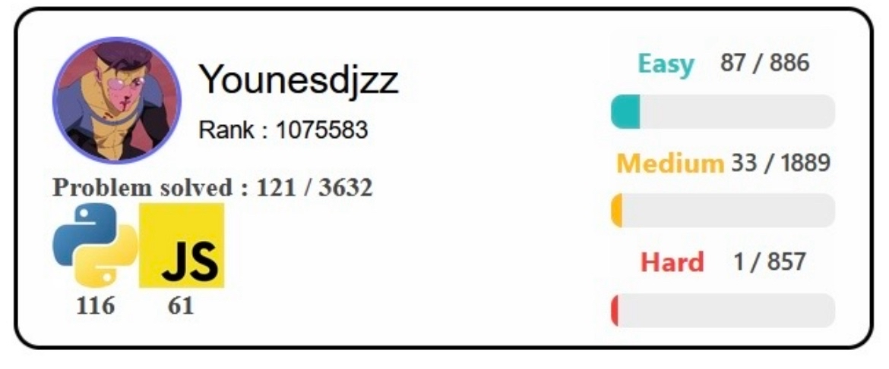
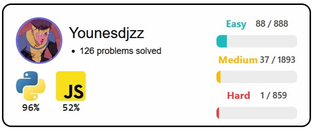
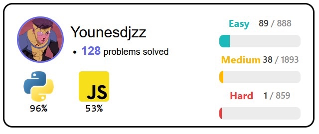
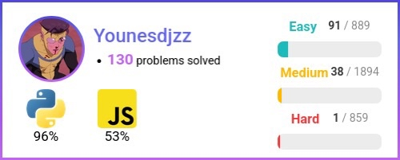

# My First Mini Project: **A Custom LeetCode Badge**

The goal is to display this badge on my personal **GitHub profile README**

## 🔍 Overview
This mini-project is built with **Flask**, a **Python** web framework, to fetch data from **LeetCode** using an **API** **every 24h**
- Hosted on [https://leetcode-badge.onrender.com/](https://leetcode-badge.onrender.com) (HTML/CSS)
- Hosted on the **repository** : app/static/badge.png (PNG image)

/!\ The website is hosted on **Render** so it may be in a sleeping mode. Try again few minutes later
  
[](https://leetcode.com/u/Yoouss/)

## The meaning behind this project
I wanted to **show my Leetcode stats on my GitHub profile**, but I only found a few models online and the **designs weren't to my taste**... So I decided to **create my own custom-designed badge** <br>

It helped me **practice my HTML/CSS skills** and gave me the opportunity to **start my first personal project** 

## ❔ How to use Flask ?
- First, **clone** the **repository** :
```bash
git clone https://github.com/Yoouss/leetcode_badge.git
cd leetcode_badge
```
- Then, **install** the **requirements.txt** in an **virtual environment** :
```bash
python -m venv venv
source venv/bin/activate
pip install -r requirements.txt
```
- Finally, to **lunch Flask**, use : <br>
```bash
flask --app app --debug run
```

## ▫️ Bonus : the evolution of the badge's design
    
    
