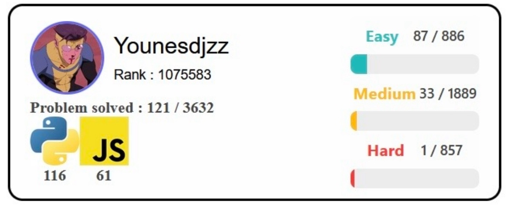
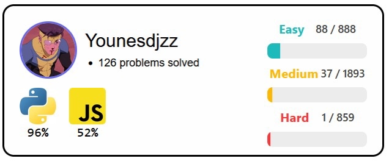
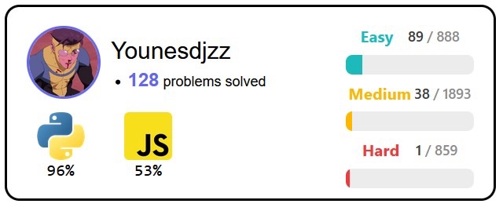
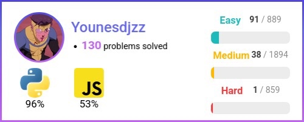

# A Customized LeetCode Badge

I wanted to **show my Leetcode stats on my GitHub profile** and I only found few models online but the **designs weren't to my taste**... So I took this opportunity to design my own one

[](https://leetcode.com/u/Yoouss/)

It helped me **practice my HTML/CSS skills** and gave me the opportunity to **start my first personal project** 

## Overview
This mini-project is built with **Flask**, a **Python** web framework, to fetch data from **LeetCode** using an **API** **every 24h**
- Hosted on [https://leetcode-badge.onrender.com](https://leetcode-badge.onrender.com) (HTML/CSS)
- Hosted on the **repository** : app/static/badge.png (PNG image)

> [!CAUTION]
> The badge is hosted on **Render** so it may be in a sleeping mode, this can take **few minutes**

**I'll soon update this README to show step by step how to use my project to display your own stats : )**

## Installation

### 0. Requirements 

<details>
<summary><b>Debian based users</b> (WSL, Ubuntu, Mint, Pop_OS!, ...)</summary>

```bash
sudo apt install python3 python3-pip python3-venv
```

</details>

<details>
<summary><b>Red Hat based users</b> (Fedora, ...)</summary>

```bash
sudo dnf install python3 python3-pip
```

</details>

<details>
<summary><b>Arch based users</b> (Arch, EndeavourOS, ...)</summary>

```bash
sudo pacman -S python python-pip
```

</details>

<details>
<summary><b>MacOS users</b></summary>

```bash
brew install python
```

</details>

---

### 1. Clone the repo and go to the project directory

- Via **https** :
```bash
git clone https://github.com/Yoouss/leetcode-badge.git && cd leetcode-badge
```

- Or **ssh** :
```bash
git clone git@github.com:Yoouss/leetcode-badge.git && cd leetcode-badge
```

---

### 2. Create a virtual environment and install the dependencies

```bash
python3 -m venv venv
source venv/bin/activate
pip install -r requirements.txt
```

if you're using **VSCode** (or any fork of it), the **`.vscode` folder helps to automatically use the virtual environment**

**You can remove the `.vscode` folder if you don't need it**

## Usage

**Each time you open the project**, activate the virtual environment :

```bash
source venv/bin/activate
```

Then start the Flask development server **to run the project locally** :

```bash
flask --app app --debug run
```

**Each time you leave the project**, deactivate the virtual environement :

```bash
deactivate
```

> [!CAUTION]
> If you send **too many requests to the API** that fetches LeetCode stats, **errors may occur** <br>
> A cache system prevents it in `__init__.py`


## Bonus : the evolution of the badge's design
    
    
