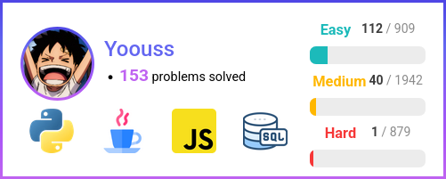

# My First Mini Personal Project: **A Custom LeetCode Badge**

## 🔍 Overview
This mini-project is built with **Flask**, a **Python** web framework, to fetch data from **LeetCode** using an **API**

## 🎯 Objective
The goal is to display my badge on my personal **GitHub profile README** !

## 🛠️ How I'm Building It
- I'm building my badge **from scratch**, using **AI** as a tool to support my **learning** and strengthen my **software development skills** without losing control over it
- First, I'm designing it using **HTML/CSS**, then I'll write a Python **screenshot script** using **AI assistance**

## ❔How to use Flask ?
- First, **install** the **requirement.txt** in an **virtual environment** :  
python -m venv venv  
source venv/bin/activate  
pip install -r requirements.txt   
- Then, to **lunch Flask**, use :  
flask --app app --debug run
